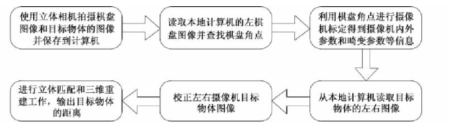

# 双目测距

## 系统框架



## 主要流程

### 标定

棋盘标定

### 校准

### 匹配

参考：https://blog.csdn.net/He3he3he/article/details/101162766

#### 局部匹配

（算法运算速度快，但在弱纹理、遮挡和视差不连续区域误匹配率高）

#### 线性匹配

```C++
#include <opencv2/core/core.hpp>  
#include <opencv2/highgui/highgui.hpp>  
#include <opencv2/imgproc/imgproc.hpp>
#include <opencv2/features2d/features2d.hpp>
#include <opencv2/nonfree/nonfree.hpp>
#include <vector> 
#include <iostream>
#include <algorithm>

using namespace cv;
using namespace std;

class parallax
{
public:
	double leftX;
	double rightX;
	double paraValue;
};

bool ascendPara(parallax a, parallax b)
{
	return a.paraValue < b.paraValue;
}

int main()
{
	Mat leftImg, rightImg;
	leftImg = imread("limg.jpg");
	rightImg = imread("rimg.jpg");
	imshow("limg", leftImg);
	imshow("rimg", rightImg);

	int minhessian = 1000;//threshold of hessian in SIFT or SURF algorithm 
	vector<KeyPoint>l_keyPoint, r_keyPoint;
	Mat l_descriptor, r_descriptor;

	SurfFeatureDetector detector(minhessian);//define a feature detection class object
	detector.detect(leftImg, l_keyPoint);
	detector.detect(rightImg, r_keyPoint);

	//compute descriptor (feature vector) of key points
	SurfDescriptorExtractor extractor;
	extractor.compute(leftImg, l_keyPoint, l_descriptor);
	extractor.compute(rightImg, r_keyPoint, r_descriptor);

	//FLANN algorithm to match feature vector
	FlannBasedMatcher matcher;
	vector<DMatch>matches;
	matcher.match(l_descriptor, r_descriptor, matches);

	//calculate the max and min distance between key points
	double maxdist = 0; double mindist = 100;
	for (int i = 0; i < l_descriptor.rows; i++)
	{
		double dist = matches[i].distance;
		if (dist < mindist)mindist = dist;
		if (dist > maxdist)maxdist = dist;
	}
	cout << "Matching quantity:" << matches.size() << endl;

	//select the good match points
	vector<DMatch>goodMatches;
	for (int i = 0; i < l_descriptor.rows; i++)
	{
		if (matches[i].distance<2 * mindist)
		{
			goodMatches.push_back(matches[i]);
		}
	}
	cout << "Good matching quantity:" << goodMatches.size() << endl;

	//calculate parallax
	vector<parallax>para;
	for (int i = 0; i < goodMatches.size(); i++)
	{
		parallax temp;
		temp.leftX = l_keyPoint[goodMatches[i].queryIdx].pt.x;
		temp.rightX = r_keyPoint[goodMatches[i].trainIdx].pt.x;
		temp.paraValue = temp.leftX - temp.rightX;
		para.push_back(temp);
		cout << "No." << i + 1 << ":\t l_X ";
		cout << para[i].leftX << "\t r_X " << para[i].rightX;
		cout << "\t parallax " << para[i].paraValue << endl;
	}
	sort(para.begin(), para.end(), ascendPara);
	int idxMedian = int(para.size()/2);
	double paraMedian = para[idxMedian].paraValue;
	vector<parallax>::iterator it;
	double errorRange = 0.005;
	for (it=para.begin(); it!=para.end(); )
	{
		if (it->paraValue<((1 - errorRange)*paraMedian) || it->paraValue>((1 + errorRange)*paraMedian))
			it = para.erase(it);
		else
			it++;
	}
	cout << "Final data..." << endl;
	double paraSum = 0;
	double paraMean;
	for (int i = 0; i < para.size(); i++)
	{
		paraSum = paraSum + para[i].paraValue;
		cout << "No." << i << "\t" << para[i].paraValue << endl;
	}
	paraMean = paraSum / para.size();
	cout << "Parallax is " << paraMean << " pixel." << endl;

	//draw the match image
	Mat matchImg;
	drawMatches(leftImg, l_keyPoint, rightImg, r_keyPoint, goodMatches, matchImg,
		Scalar::all(-1), Scalar::all(-1), vector<char>(), DrawMatchesFlags::NOT_DRAW_SINGLE_POINTS);
	imshow("match", matchImg);

	waitKey(0);
	return 0;
}

```

ps：1.代码中使用的是SURF算法，需要用SIFT的只需要将代码中`SurfFeatureDetector`和`SurfDescriptorExtractor`改成`SiftFeatureDetector`和`SiftDescriptorExtractor`即可；
2.匹配结果`DMatch`中存储着匹配点对的索引，分别在`DMatch[i].queryIdx`和`DMatch[i].trainIdx`中，这是找到匹配对的关键。

#### 全局匹配

（算法精度高，但计算复杂度也相应的较高，耗时长，难以达到实时性）

#### 特征匹配

## 参考文献

1. [基于OpenCV的双目测距系统](https://www.ixueshu.com/document/214c9856c4611007fd5cd51ef69eeb99318947a18e7f9386.html)
2. [【OpenCV】基于SIFT/SURF算法的双目视差测距](https://blog.csdn.net/qinchang1/article/details/86934636)